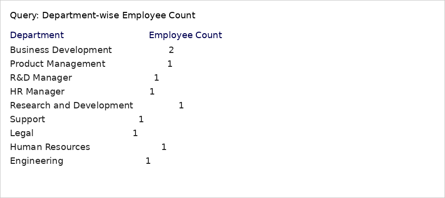
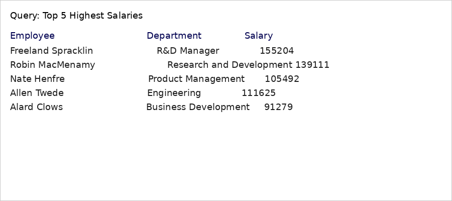

<!-- Portfolio README for Employee Management System (SQL) -->

<p align="center">
  
</p>

<p align="center">
  
  
  
</p>

# Employee Management System (SQL)

A clean, beginner-friendly SQL project that demonstrates real-world database design, data modeling, and analytical querying. Ideal for showcasing foundational SQL skills in a professional portfolio or resume.

## Table of Contents
- [About](#about)
- [Demo Screenshots](#demo-screenshots)
- [Features](#features)
- [Project Structure](#project-structure)
- [How to Run](#how-to-run)
- [Portfolio Section](#portfolio-section)
- [Future Improvements](#future-improvements)
- [License](#license)

## About
This repository simulates a small corporate employee database with hierarchical reporting (manager–employee relationships), departmental structures, and example HR analytics queries.

## Demo Screenshots
<p align="center">
  
</p>

<p align="center">
  
</p>

## Features
- Relational schema with primary & foreign keys (self-referencing)
- Sample dataset of realistic employee records
- Analytical queries: aggregations, joins, conditional updates
- Beginner-friendly, well-commented SQL scripts

## Project Structure
```
employee-management-sql/
├── banner.png
├── screenshot_query.png
├── screenshot_salary.png
├── schema_and_data.sql
├── README.md
├── LICENSE
└── .gitignore
```

## How to Run
1. Clone or download this repo.
2. Open `schema_and_data.sql` in MySQL Workbench and execute the script.
3. Run the example SELECT queries to explore the dataset.

## Portfolio Section
**Project Title:** Employee Management System (SQL)  
**Role:** Developer / Data Engineer (Individual Project)  
**Duration:** 1 week  
**Key Contributions:**
- Designed normalized employee schema with manager hierarchy.
- Implemented sample data and analytic queries for HR insights.
- Documented project with professional README, screenshots, and badges for portfolio presentation.

**Skills Demonstrated:** SQL (DDL/DML), data modeling, joins, aggregations, basic ETL concepts, documentation.

**How to Present in Interviews:**
- Explain the self-referencing foreign key pattern for manager relationships.
- Walk through one or two SQL queries (e.g., self-join to list manager names).
- Discuss how you would scale the schema (normalize departments, add projects table).

## Future Improvements
- Add departments table and enforce referential integrity.
- Add stored procedures for common HR tasks.
- Populate with 500 synthetic records for analytics practice.
- Build a Power BI dashboard or a small web frontend.

## License
This project is licensed under the MIT License - see the LICENSE file for details.
